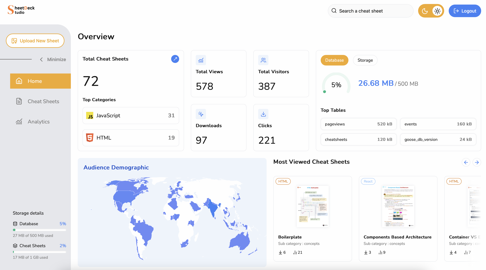
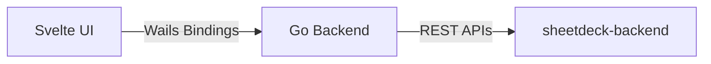

 

 
 

# 📚 Sheetdeck Studio

**Sheetdeck Studio** is a desktop admin dashboard built for managing the [Sheetdeck](https://sheetdeck.vercel.app) platform.

It is developed using **Wails**, with a **Go backend** and a **Svelte frontend**, and connects to the [Sheetdeck backend server](https://github.com/Ritika-Agrawal811/sheetdeck-backend) to manage cheat sheets, analytics, and configuration data through a unified interface.

 

## 🎯 Why This Project?

The goals of this project include :
- Providing a dedicated admin interface for managing content and analytics for the **Sheetdeck** platform.
- Creating a fast, cross-platform desktop tool that allows efficient content management, monitoring, and configuration without relying on browser-based admin panels.
- Gaining hands-on experience building and integrating **Go backends with modern frontend frameworks (Svelte)**

 

## 🧠 Key Highlights

- Built a component-based UI using **Svelte**, with **plain CSS** to ensure a responsive layout across different desktop screen sizes
- Implemented **biometric authentication (fingerprint)** on macOS to secure access to the admin dashboard
- Integrated **LayerChart** and **Chart.js** to visualize analytics data through interactive graphs
- Designed clear and structured application pages including :
  - Home
  - Cheat Sheets management
  - Analytics overview
  - Upload Cheat Sheet workflows
- Built a robust **cheat sheet upload form** with client-side validation
- Integrated the upload workflow with the backend APIs to store cheat sheets and assets in **Supabase and Supabase Storage**
- Used **@tanstack/svelte-query** to manage API state, caching, and async workflows in the dashboard

 

## 🛠 Tech Stack

- **Desktop Framework:** Wails
- **Backend (Desktop):** Go (Golang)
- **Frontend:** Svelte
- **UI Styling:** Plain CSS (responsive layout for desktop screens)
- **State & Data Fetching:** @tanstack/svelte-query
- **Charts & Visualization:** LayerChart, Chart.js
- **Authentication:** macOS biometric (fingerprint) authentication
- **API Integration:** REST APIs provided by `sheetdeck-backend`
- **Tooling:** Go modules, Vite (Svelte), standard Wails tooling

 

## 🏗 Architecture Overview

Sheetdeck Studio follows a clear separation between the desktop backend and the frontend UI, using Wails to bridge the two layers.

- **Application Bootstrap:**  
  The desktop application is initialized using `main.go` and `app.go`, which handle Wails configuration, lifecycle management, and application startup.

- **Desktop Backend Layer (Go):**  
  The Go backend acts as an orchestration layer between the frontend and the Sheetdeck backend server.
  - API clients are organized under an `internal/api` package, with separate modules for cheat sheets, analytics, and configuration.
  - Shared data models and reusable utilities are defined in `models` and `pkg`.
  - All communication with Supabase and storage happens indirectly via the backend APIs, ensuring the desktop app acts purely as a client and does not own or persist core application data.

- **Frontend Layer (Svelte):**  
  The frontend lives in the `frontend/src` directory and is structured for scalability and maintainability.
  - **Pages** define high-level routes such as Home, Cheat Sheets, Analytics, and Upload workflows.
  - **Components** are organized into `common`, `layout`, and `features` to encourage reuse and consistency.
  - **Queries** handle API interactions using `@tanstack/svelte-query`, managing caching, loading, and error states.
  - **Stores, types, utils, and constants** provide shared state management, type safety, and reusable logic.

- **Frontend ↔ Backend Communication:**  
  The Svelte frontend communicates with the Go backend through Wails bindings, while the Go backend communicates with the Sheetdeck backend server via REST APIs.

 

## 📈 Future Improvements

- Add a **search feature** to quickly find cheat sheets across categories and content
- Introduce **dark mode** support to improve usability and accessibility for extended usage
- Implement **proper authentication for Windows**, including username and password–based login

 

## 📄 License

The **codebase** of this project is open source and licensed under the [MIT License](./LICENSE).

 

## 🚫 Contributions

This is a personal project intended for internal use with the Sheetdeck platform and is not designed as a standalone application. I'm NOT accepting pull requests, issues, or external contributions.

• • •

## ☕️ Support Me

Give a ⭐ if you like this project, and share it with your friends. Your support means a lot and helps me create more useful resources!

  

**Thanks so much! Happy Coding!** :sparkles:
